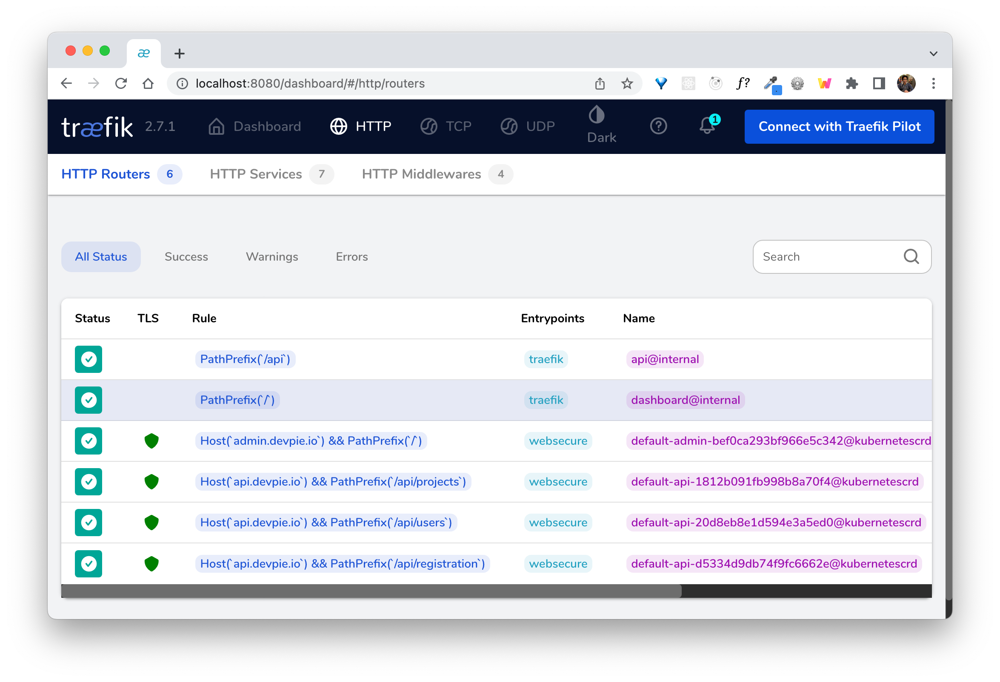
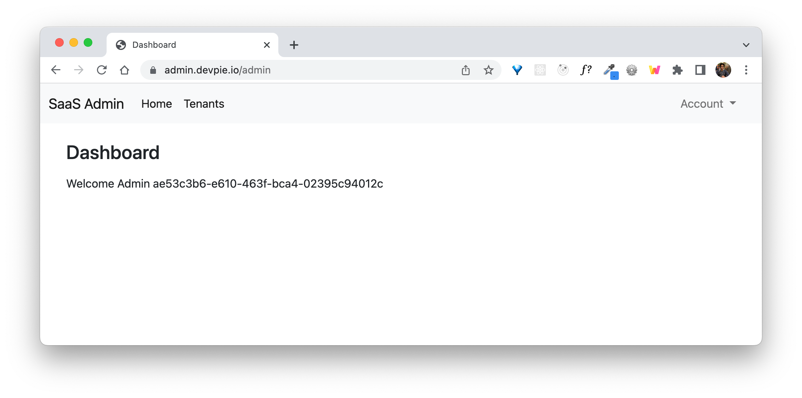
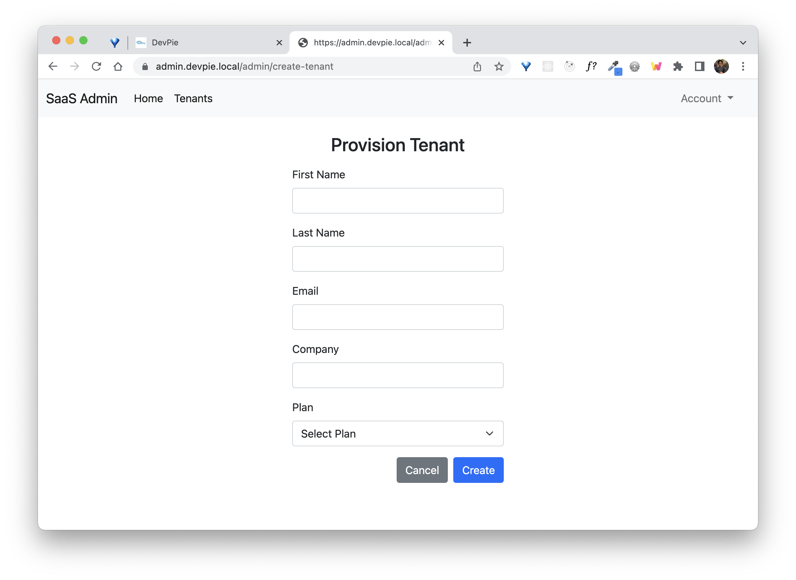

# Setup Guide

Tested on a m1 mac . It should work on linux as well.

## Requirements

- aws account
- kubernetes
- tools:
  - [terraform](https://www.terraform.io/)
  - [go v1.21 or higher](https://go.dev/doc/install)
  - [tilt](https://tilt.dev/)
  - [mkcert](https://github.com/FiloSottile/mkcert)
  - [mockery](https://github.com/vektra/mockery)
  - [pgcli](https://www.pgcli.com/)
  - [golangci-lint](https://github.com/golangci/golangci-lint)
  - [go-migrate](https://github.com/golang-migrate/migrate)
- [saas-infra resources](https://github.com/devpies/saas-infra)

## Instructions 

1. Checkout `saas-infra` and deploy the `local` infrastructure.
   - You will need to supply a valid email for the _SaaS provider admin user_. This user is used to
   login to the admin web app.
2. Copy `./manifests/secrets.sample.yaml` and create your own `./manifests/secrets.yaml` file.
3. Generate valid tls self-signed certificates: `mkcert devpie.local "*.devpie.local" localhost 127.0.0.1 ::1`
4. Generate the `tls-secret` yaml for traefik with the certificate values: 
   ```
   kubectl create secret generic tls-secret --from-file=tls.crt=./devpie.local.pem --from-file=tls.key=./devpie.local-key.pem -o yaml 
   ```
   Then add the contents to the bottom of your secrets.yaml file.
5. Modify your hosts file:
   ```bash
    ##
    # Host Database
    #
    # localhost is used to configure the loopback interface
    # when the system is booting.  Do not change this entry.
    ##
    127.0.0.1       localhost devpie.local admin.devpie.local api.devpie.local 
    ```
6. Initialize project with setup scripts: `make init`
7. Start containers: `tilt up`
8. Initialize databases with base schema: `make init-db`
9. Port forward the traefik ports: `make ports`
10. Deploy ingress routes: `make routes`
http://localhost:8080/dashboard/#/http/routers

     

11. Login to the SaaS admin app (check your email for credentials).
    
12. Create a new tenant. This is required to log into the SaaS-Client application (https://devpie.local:3000). Use a real email. 
You will be sent a password.
      

## Getting Help
If you need help or have questions create an issue. Alternatively, you can join our [discord server](https://discord.gg/MeKKvHBKQG) 
and reach out there.

## Contributions
If you have ideas on automating this setup feel free to submit a PR. 

### Gotchas
golangci-lint returns error on new mac versions.
https://github.com/golangci/golangci-lint/discussions/3327

FIX: `brew install diffutils`
